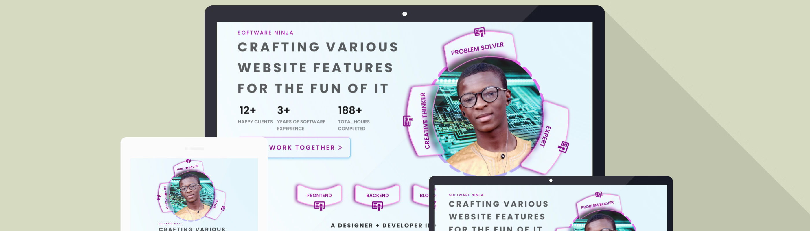

## 👫 Connect With Me On 👫
 
 
 
  
 
 

## 👨‍💻 About me 👨‍💻
Hi I am Mustapha Sa'ad, a tech enthusiast currently studying computer engineering. I am a self taught full-stack web developer, a web designer, and a freelancer where I get to solve problems by building on web solutions. I wish to contribute to open source projects more often on anything concerning the web, so if you have one, please do contact me and I'll be more than willing to help.

## ✨ Languages and frameworks I know and study ✨
  
  
  
  
  
  
  
  
  
  
  
  

## 🗽Stats🗽

 
 ## Trophies
 
 
<!--
**Mustapha-Saad/Mustapha-Saad** is a ✨ _special_ ✨ repository because its `README.md` (this file) appears on your GitHub profile.

Here are some ideas to get you started:

- 🔭 I’m currently working on ...
- 🌱 I’m currently learning ...
- 👯 I’m looking to collaborate on ...
- 🤔 I’m looking for help with ...
- 💬 Ask me about ...
- 📫 How to reach me: ...
- 😄 Pronouns: ...
- ⚡ Fun fact: ...
-->
